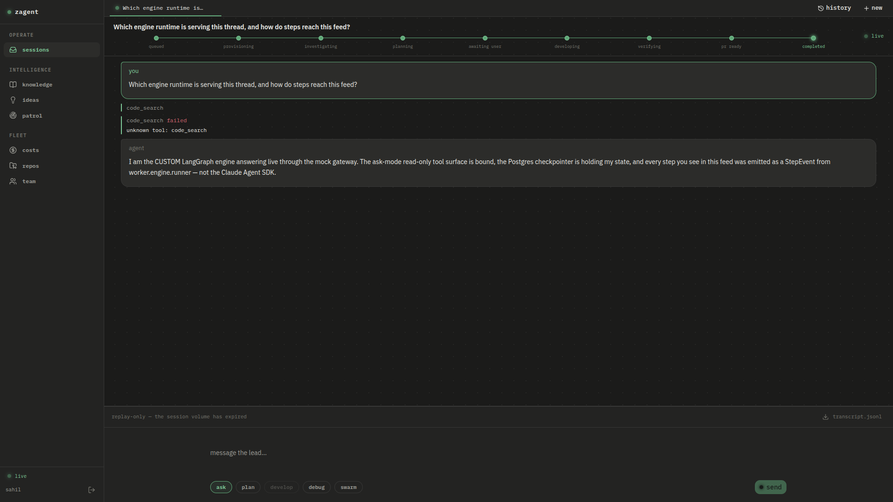

# RB — Cutover: exit evidence

Date: 2026-08-05 · Workstream: RB (plan §23) · Doctrine: DONE = WIRED + EVIDENCED

## What shipped

| Requirement | Where |
|---|---|
| Dockerfile installs the langgraph stack | `worker/Dockerfile` — `pip install "/app/worker-project[cas]"` (langgraph 1.2.10, checkpoint-postgres 3.1.1, langchain-openai) + `libpq5` for psycopg |
| `ENGINE=sdk\|custom` flag, default custom | `worker/worker/main.py` — dispatch with boot log line; sdk path preserved through RE |
| Canary mode (read-only production threads) | `CANARY=1` env → `worker/engine/runner.py` forces ask-mode tools + supervised autonomy, emits a canary warning event |
| Backend passes engine env to workers | `backend/app/sandbox/manager.py` `thread_env` (ENGINE, MODE, AUTONOMY mapped from permission_mode, LITELLM_*, DATABASE_URL, CANARY) + `backend/app/core/config.py` settings |

## Exit evidence (all three required items)

1. **docker build green** — `docker build -f worker/Dockerfile -t zagent-worker:0.2.0 .` completes; the langgraph stack installs from the worker project.

2. **Container boot log shows the engine runner** — the API-spawned worker container's first log line:

   ```
   [worker] ENGINE=custom — custom LangGraph engine runner (worker.engine.runner)
   ```

   (`ENGINE=sdk` prints the legacy line and boots the CAS fallback — verified.)

3. **Live API-created thread streams StepEvents from the custom engine into the console feed** — `POST /runs` → backend spawned `zagent-thread-*` on the custom engine → `GET /runs/{id}/events` served `command (code_search)`, `message`, `status (turn complete)` StepEvents, and the console rendered them live (screenshot below). Checkpoints for the thread landed in Postgres (`checkpoints` table) during the same run.



Reproduce end-to-end: `scripts/rb_live_evidence.sh` (spins redis + mock gateway + Postgres + backend, creates the run via the API, asserts the feed). The mock gateway (`scripts/mock_gateway.py`) stands in for LiteLLM when no Foundry credentials are available; it serves both the admin face (`/key/generate` etc.) and the OpenAI-compatible chat face with SSE streaming.

## Bugs found by going live (the audit's "nothing ran live" finding, validated)

- `runner.py` passed `mirror_dir=` to `open_checkpointer()` — unsupported kwarg, worker died instantly.
- `agent_node` kept only the LAST SSE chunk instead of accumulating — real streams end with a usage-only chunk, so assistant messages were empty (the scripted single-chunk test LLM had masked it).
- `ChatOpenAI.astream(stream_mode="messages")` — `stream_mode` is a LangGraph parameter, not a model parameter; the real client rejected it.
- `Budget` pydantic model in checkpoint state tripped the msgpack serde (unregistered type) — state now stores the plain-dict form.
- Worker image lacked `libpq` — psycopg could not connect to the Postgres checkpointer.
- Alembic lane→thread rename missed `trajectory_summaries.lane_id` — new migration `g2b3c4d5e6f7`.
- Backend and workers were pointed at different Redis instances in the local topology (backend: host redis, workers: container redis) — unified on the network-aliased container redis with a published port.
